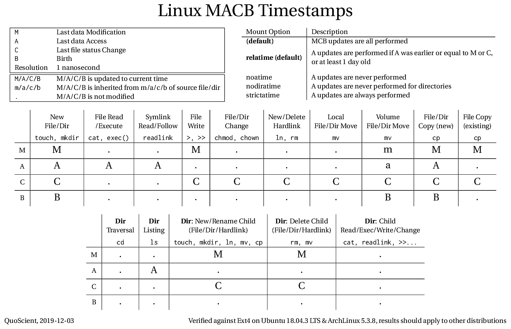
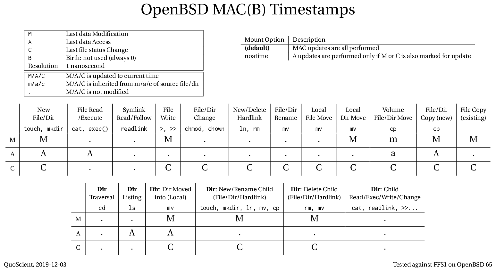
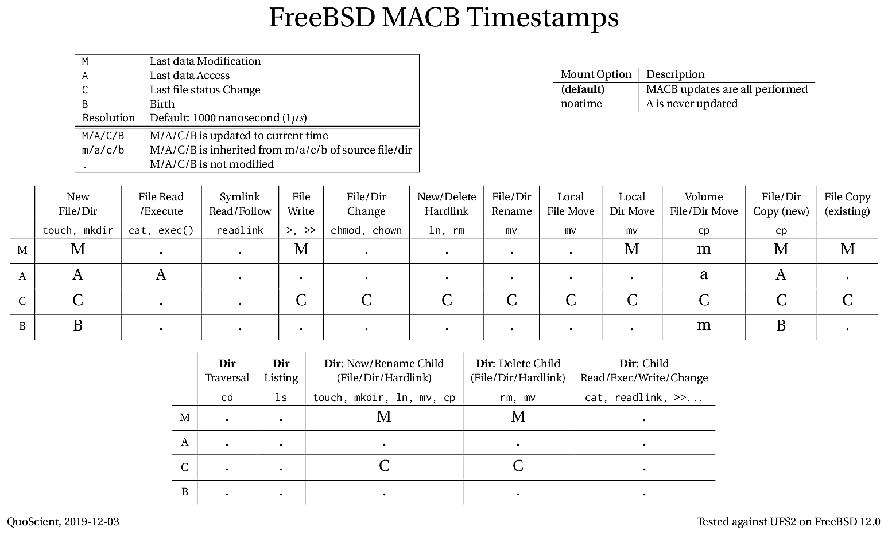

<!---
title: "MAC(B) Timestamps across POSIX implementations (Linux, OpenBSD, FreeBSD)"
date: 2019-12-03T13:13:17+02:00
aliases: [
	"/posts/01_macb_timestamps_across_posix/"
]
Author: 
  Name: "Aurelien Thierry"
  Twitter: "yaps8"
Categories: ["OS timestamps"]
Tags: ["POSIX", "Linux", "OpenBSD", "FreeBSD", "timestamps", "forensics"]
-->

> Published: December 3, 2019

```
This blog post was first published in December 2019 on behalf of QuoScient on medium.com:
https://medium.com/@quoscient/mac-b-timestamps-across-posix-implementations-linux-openbsd-freebsd-1e2d5893e4f
```

# Introduction

File timestamps are crucial forensics artifacts when investigating a machine during a security incident, they are regularly modified and can provide both primitive information (when the file was last modified) and inferred information (when the file was probably moved there from another file system).

The “Windows Time Rules” from SANS [1] is an excellent resource on which MACB timestamp is updated by each common operation (file creation, file copy…) on Windows, and it did not have an equivalent in the Unix world.

POSIX (Portable Operating System Interface) is a set of specifications for Unix-like OSes. It defines interfaces (system calls) and utilities behavior, including MAC updates, for consistency and compatibility across the Unix world.

In this post we decribe how timestamps updates are specified within POSIX, how they are implemented on Linux, OpenBSD and FreeBSD, provide code to find this out automatically and tables with MAC(B) updates for each OS.

# 1 - POSIX and MAC(B) timestamps

This study is based on the POSIX “draft” C181 from 2018 (“Base Specifications, Issue 7, 2018 Edition”) [2].

POSIX specifies MAC timestamps:

> Each file has three distinct associated timestamps: the time of last data access, the time of last data modification, and the time the file status last changed. These values are returned in the file characteristics structure struct stat, as described in <sys/stat.h>.

Data access (A) is when the file data is read, data modification (M) when the file data is modified, and file status changed (C) when the file metadata is changed (chown, chmod, new hardlink updating the link count…).

> The <sys/stat.h> header shall define the stat structure, which shall include at least the following members:

~~~ c
struct timespec st_atim - Last data access timestamp.
struct timespec st_mtim - Last data modification timestamp.
struct timespec st_ctim - Last file status change timestamp.
~~~

> The <time.h> header shall declare the timespec structure, which shall include at least the following members:

~~~ c
time_t  tv_sec   Seconds.
long    tv_nsec  Nanoseconds.
~~~

The fourth timestamp (called “**B**” for birth, or “**cr**” for creation) used by some file systems to store the date of file creation is not at all discussed in POSIX. There is SANS series describing implementation in EXT4 for example [3].

## 1.1 - General behavior

POSIX specifies some general update rules, for instance:

> When a file that does not exist is created […] the last data access, last data modification, and last file status change timestamps of the file shall be updated.

Thus a new file shall get updated MAC.

## 1.2 - Interfaces and utilities

POSIX specifies both interfaces (system calls) and utilities (commands such as mv). For instance for a file move such as mv source_file target_file performed locally (source_file and target_file on same filesystem):

* Utility — `mv [−if] source_file target_file`

> The mv utility shall perform actions equivalent to the rename( ) function […] with the following arguments […]: the source_file operand is used as the old argument […], the destination path is used as the new argument.

* Interface — `rename(const char *old, const char *new)`

> Upon successful completion, rename( ) shall mark for update the last data modification and last file status change timestamps of the parent directory of each file. Some implementations mark for update the last file status change timestamp of renamed files and some do not.

So the POSIX way to move a file locally implies updating MC of the parent directory of both **source_file** and **target_file**, and possibly (depending on the implementation) update C of the moved file. What happens to the other timestamps is not described: they shall not be modified.

## 1.3 - POSIX (Non-)Compliance

In addition to some freedom left to implementations in POSIX specification, the OSes tested do not attempt to be strictly POSIX-compliant.

For instance on Linux, the LSB (Linux Standard Base) requires POSIX compliance but it is not followed by a lot of distribution and very few are certified: [https://en.wikipedia.org/wiki/Linux_Standard_Base#Reception](https://en.wikipedia.org/wiki/Linux_Standard_Base#Reception)

Cases of non-compliance with some MAC updates from POSIX are not bugs but achitecture and implementation choices, for instance for performance reasons.

## 1.4 - B Timestamp

Though not specified by POSIX, Linux on EXT4 and FreeBSD on UFS2 store the date of creation (**B**).

The **B** field exists and can be read in OpenBSD on FFS1 but it is never filled and is always 0.

## 1.5 - Impact of mount options

Mount options exist to improve performance by restricting or disabling the update of some timestamps.

### Linux

* **(default) — MCB updates are all performed**
* **relatime (default) — A updates are performed if A was earlier or equal to M or C, or at least 1 day old**
* noatime — A updates are never performed
* nodiratime — A updates are never performed for directories
* strictatime — A updates are always performed

Since Linux 2.6.30 (released in 2009), the default option is relatime, this means that reading twice the same old file on the same day will update A the first time but not update it again.

The 1 day delay is hardcoded in kernel code: [https://github.com/torvalds/linux/blob/master/fs/inode.c#L1614](https://github.com/torvalds/linux/blob/master/fs/inode.c#L1614)

### OpenBSD

* **(default) — MAC updates are all performed**
* noatime — A updates are performed only if M or C is also marked for update

With the noatime option, modifying a file with a simple text editor would first open it for read (A) then for write (MC), thus A will not be marked for update at the same time as M or C and will not be updated. Thus A will mostly be updated at file creation.

### FreeBSD

* **(default) — MACB updates are all performed**
* noatime — A is never updated

## 1.7 - Timestamp Resolution

POSIX specifies a minimum resolution of 1s:

> The resolution of timestamps of files in a file system is implementation-defined, but shall be no coarser than one-second resolution.

### Linux — nanosecond

```
$ stat file
  Access: 2019–05–20 09:03:37.574284871
```

### OpenBSD — nanosecond

```
$ stat -f “Access: %Fa” file
  Access: 1558333479.574284871
```

### FreeBSD — microsecond

```
$ stat -f “Access: %Fa” file
  Access: 1558333479.574284000
```

Both Linux on EXT4 and OpenBSD on FFS store the timestamps to the maximum resolution of the file system, the nanosecond.

FreeBSD on UFS2 by default stores the timestamps to the microsecond resolution even though the file system supports nanosecond resolution.
This can be changed to nanosecond precision with:

`# sysctl vfs.timestamp_precision=3`

Default is 2, as explained in **man vfs_timestamp**:


    0 seconds only; nanoseconds are zeroed.
    1 seconds and nanoseconds, accurate within 1/HZ.
    2 seconds and nanoseconds, truncated to microseconds.
    >=3 seconds and nanoseconds, maximum precision.


# 2 - Automatic MACB profiling

We implemented a test suite to determine, for each operation such as Move, Copy, Read, Execution, Deletion, Directory Listing… how the MACB timestamps are impacted.

This is project os_timestamps: [https://github.com/QuoSecGmbH/os_timestamps](https://github.com/QuoSecGmbH/os_timestamps)

For instance:

* The Move operations are splitted into “Local File Move”, “Local Dir Move”, “Volume File Move” and “Volume Dir Move”.
* “Local File Move” is a move from **srcdir/src** to **dstdir/dst**, the two files (src, dst) and the two directories (srcdir/, dstdir/) are watched for change

Then “Local File Move” is tested across 4 implementations:

* With interface `rename()` when the destination file does not exist
* With interface `rename()` when the destination file already exists
* With utility `mv` when the destination file does not exist
* With utility `mv` when the destination file already exists

The output, if all 4 implementations give the same result, is (on Linux):

```
./profile_osLocal File Move (PROFILE.OS.FILE.MV_LOCAL):
 src
   !!!!
 srcdir/
   M.C.
 dst
   >>C>
 dstdir/
   M.C.
```

Here are the symbols used:

```
M/A/C/B   M/A/C/B is updated to current time
>         M/A/C/B is the inherited from source file/dir
.         M/A/C/B is not modified
!         Error (mostly: the file did not exist anymore)
```

Here, focusing on the file’s inode (**src** and **dst** have the same inode), C is updated and the other timestamps are unchanged.

The implementation watches paths and not inodes, so it recognizes that **dst**’s M is the same as **src**’s M (>) but we know than it is really just kept the same (.).

This example shows that automatic profiling helps but the results need to be interpreted.

## 2.1 - Utilities tested

Besides interfaces (syscalls), only standard POSIX utilities (commands) are tested:

* touch, mkdir
* mv, cp
* cat, shell output redirection (>, >>)
* ln, readlink
* cd, ls
* chmod, chown
* rm

## 2.2 - Common operations
### New file, new directory

* A new file or directory gets updated MAC(B).
* Its parent directory gets updated MC.

### New hardlink (to file)

* A new hardlink (to a file) updates the file’s C.
* The hardlink’s parent directory get updated MC.

### File Read

* A file being read gets updated A.
* Its parent directory is not updated.

### File Write

* A file being written to gets updated MC.
* Its parent directory is not updated.

### File or Directory Change

* A file or directory being changed (chown, chmod) gets updated C.
* Its parent directory is not updated.

### File Execution

* A binary file being executed gets updated A.
* Its parent directory is not updated.

### File or Directory Deletion

* Deleting a file or directory updates MC of the parent directory.
* If it was not the last hardlink to the inode, the inode gets updated C.

## 2.3 - Directory Operations
### Dir Traversal

Dir traversal does not update any timestamp.

### Dir Listing

* **POSIX, Linux, OpenBSD**: dir listing updates the directory’s A.
* **FreeBSD**: dir listing does not update any timestamp.
* Files in the directory are not updated.

## 2.4 - Symlinks

Symbolic links are followed (or dereferenced) to determine their target by calling readlink.

### Readlink

* **POSIX, Linux**: readlink on a symlink updates the symlink’s A
* **OpenBSD, FreeBSD**: readlink does not update the symlink
* readlink does not update the timestamps of the link’s target

Readlink updating A (on Linux) implies that operations done to the target through the symlink will update the symlink’s A. For instance traversing a symlink (to a directory) will update the symlink’s A even though directory traversal does not update the directory.

For instance on ArchLinux **/bin** is a symlink to **/usr/bin**, so executing **/bin/ls** will update **/bin**’s A (this is limited by relatime):

```
$ stat -c %x /bin
  2019-11-25 21:28:34 +0000
$ /bin/ls
[...]
$ stat -c %x /bin
  2019-11-25 21:28:41 +0000
```

Note the use of a custom `stat` format, this is necessary as the default `stat` options display the link target using readlink, updating C in the process.

### Follow or not follow

Operations on the link itself will not modify the target while operations on the target through the link may update the target additionnally to the readlink consequence. Except `stat` most utilities seem to dereference by defaut but have options such as `--no-dereference` to aim at the link.

On Linux it is not possible to `chmod` a symlink (it is not implemented by the syscall), but this is possible on OpenBSD and FreeBSD.

## 2.5 - Local File/Dir Move
### File/Dir Rename

Rename is a move when the source and destination have the same parent directory (`mv file dst`):

* C gets updated
* The parent directory gets updated MC

### Local File Move

A local file move is also a simple case:

* **POSIX**: C may be updated (optional)
* **Linux, OpenBSD, FreeBSD**: C gets updated
* The source’s parent directory gets updated MC
* The destination’s parent directory gets updated MC

### Local Dir Move

Local dir move is more complicated, as stated in Linux’s vfs_rename:

> The worst of all namespace operations — renaming directory. “Perverted” doesn’t even start to describe it.

Hopefully we’re only describing relevant MACB updates.

This description is based on OpenBSD’s code, FreeBSD’s implementation is alike and Linux’s behavior is similar.

For clarity we describe a move from **dir/** to **dst/**, performed with a call to `rename(dir/, dst/)`.

#### Path check
First check that source directory is not in the path of the target directory (`rename(dir/, dir/dst/)` would orphan everything below **dir/**). This mostly loops reading **dst/** parent directories until it finds **dir/** or **/**, all checked directories (from **dst/..** to / or **dir/**, excluding **/** and **dir/**) get updated A on OpenBSD, but not on FreeBSD nor Linux.

#### New dst/
If **dst/** does not exist the **dir/** directory is added to the destination directory’s parent (updating MC) and removed from the source directory’s parent (updating MC). The moved directory gets updated C.

#### Existing dst/
If **dst/** already exists, the **dst/** inode is kept (inode number stays the same) but its contents (inode, child files and directories…) are replaced by **dir/**. This updates **dst/**’s MC on OpenBSD and FreeBSD, not on Linux; and updates the destination directory’s parent MC. The source **dir/** is then deleted (updating parent MC).

#### dst/.. fix
In both cases the directory entry **dst/..** now points to the source’s parent directory and needs to be fixed to point to **dst/**. This operation updates **dst/**’s MC on OpenBSD and FreeBSD, not on Linux.

Note that for each OS the timestamp updates are the same whether dst/ existed or not.

In the end:

* **Linux**: C gets updated / **OpenBSD, FreeBSD**: MC get updated
* The source’s parent directory gets updated MC
* The destination’s parent directory gets updated MC (**Linux, FreeBSD**) / MAC (**OpenBSD**)
* **OpenBSD**: some further destination’s parent directories get updated A

Linux’s behavior is POSIX-compliant and is the same for **File/Dir Rename** and **Local File/Dir Move**.

## 2.6 - Volume File/Dir Move

* MA are inherited from source
* C is updated
* **Linux**: B gets updated
* **FreeBSD**: B is inherited from the original M value
* The source’s parent directory gets updated MC
* The destination’s parent directory gets updated MC

**futimens.** Linux and FreeBSD both create a new destination with an updated B and then restore MA with `futimens()`.

FreeBSD’s `futimens()` calls `setutimes()` that:

* Sets A and M as requested
* If the requested M is earlier than B: set B to the requested M

### MA ealier than B

File moved across volumes by Linux can be identified as they have the unique property to have MA (copied from source) earlier than B (updated).
Note that only copy both from and to EXT4 file systems were tested.

## 2.7 - Copy

There is no difference between a local file copy and a volume file copy.

### File Copy

* The source file gets updated A

If the destination did not exist:

* The new file gets updated MAC(B)
* The destination’s parent directory gets updated MC

If the destination already existed:

* It gets updated MC
* The destination’s parent directory is not updated

Basically a file copy (`cp src dst`) is: [new dst] + `read(src)` + `write(dst)`.

### Directory Copy (recursive)

* The source directory is listed (A updated on **POSIX, Linux and OpenBSD**)
* If the destination directory did not exist, the new directory gets updated MAC(B) and the destination’s parent directory gets updated MC
* Files are copied as described in **File Copy**
* Directories are copied recursively

A recursive directory copy (`cp -r src/ dst/`) is:

* `dirlisting(src/)`+ [new dst/] + [File Copies] + [recursive Dir Copies]

# 3 - Aggregated results
## 3.1 - POSIX

The CSV profile for POSIX was built manually from the specification and is available here:
* [https://github.com/QuoSecGmbH/os_timestamps/blob/master/results/2019_11_29/profileos/posix/os_profile.csv](https://github.com/QuoSecGmbH/os_timestamps/blob/master/results/2019_11_29/profileos/posix/os_profile.csv)

`*` is an additional symbol for when POSIX leaves a choice to the implementation

## 3.2 - Linux

### Setup

* Ubuntu 18.04.3 LTS and ArchLinux 5.3.8-arch1–1 VM
* EXT4 filesystem
* (not default) strictatime mount option

### Result

With the **strictatime** mount option Linux is POSIX-compliant on those MAC tests.

Keep in mind that by default a lot of repeated A updates are skipped due to **relatime**.

The second table focuses on directory operations: dir listing, what happens to a directory when a new child file is created, when a child directory is deleted, etc.



* Full size PDF: [https://github.com/QuoSecGmbH/os_timestamps/releases/download/2019_12_03/linux_macb.pdf](https://github.com/QuoSecGmbH/os_timestamps/releases/download/2019_12_03/linux_macb.pdf)
* CSV result: [https://github.com/QuoSecGmbH/os_timestamps/blob/master/results/2019_11_29/profileos/linux/os_profile_results.csv](https://github.com/QuoSecGmbH/os_timestamps/blob/master/results/2019_11_29/profileos/linux/os_profile_results.csv)

## 3.3 - OpenBSD
### Setup

* VM: OpenBSD 65 GENERIC#3 amd64
* FFS1 filesystem

### Result

The operation “**Dir**: Dir Moved into (Local)” describes the MAC changes to a directory that sees another directory being moved there from the same file system, it is due to the **Path Check** step happening in the “Local Dir Move” operation described previously.



* Full size PDF: [https://github.com/QuoSecGmbH/os_timestamps/releases/download/2019_12_03/openbsd_mac.pdf](https://github.com/QuoSecGmbH/os_timestamps/releases/download/2019_12_03/openbsd_mac.pdf)
* CSV result: [https://github.com/QuoSecGmbH/os_timestamps/blob/master/results/2019_11_29/profileos/openbsd/os_profile_results.csv](https://github.com/QuoSecGmbH/os_timestamps/blob/master/results/2019_11_29/profileos/openbsd/os_profile_results.csv)

## 3.4 - FreeBSD
### Setup

* VM: FreeBSD 12.0 (64 bits)
* UFS2 filesystem

### Result



* Full size PDF: [https://github.com/QuoSecGmbH/os_timestamps/releases/download/2019_12_03/freebsd_macb.pdf](https://github.com/QuoSecGmbH/os_timestamps/releases/download/2019_12_03/freebsd_macb.pdf)
* CSV result: [https://github.com/QuoSecGmbH/os_timestamps/blob/master/results/2019_11_29/profileos/freebsd/os_profile_results.csv](https://github.com/QuoSecGmbH/os_timestamps/blob/master/results/2019_11_29/profileos/freebsd/os_profile_results.csv)

# Conclusion

Though POSIX describes at great length when the MAC timestamps shall be updated, there are major implementation differences across Linux, OpenBSD and FreeBSD.

This is no bug as none aim for strict POSIX compliance and some of the differences are clear optimisation efforts to mitigate the extremely frequent A updates each time a file is read.

Forensics analysts working on multiple UNIX-like environments should be aware of those implementation differences, the “MAC(B) Timestamps” tables can be used for reference on each OS.

## Key Differences

* Linux restricts by default A updates: A may be updated at most once a day.
* Linux and OpenBSD update A on directory listing, FreeBSD doesn’t.
* Linux is the only one to update A when reading/following a symlink.
* Both OpenBSD and FreeBSD have inconsistent timestamp updates on rename and local move operations depending on whether the source is a file or directory.
* Linux and FreeBSD update the additional B (Birth) timestamp, OpenBSD doesn’t.
* Files moved across different file systems get an updated B timestamp on Linux, on FreeBSD their B timestamp is set to the source’s M timestamp.

## Contacts

* Aurélien Thierry ([@yaps8](https://twitter.com/yaps8))
* QuoSec ([@QuoSecGmbH](https://twitter.com/QuoSecGmbH)) - [https://quosec.net](https://quosec.net)
* QuoScient ([@QuoScient](https://twitter.com/quoscient)) — [https://www.quoscient.io](https://www.quoscient.io)

## References

os_timestamps — https://github.com/QuoSecGmbH/os_timestamps

[1] Windows Forensic Analysis (SANS) — https://www.sans.org/security-resources/posters/windows-forensic-analysis/170/download

[2] The single UNIX specification, version 4 — https://github.com/geoff-nixon/posix-unix-standard

`We used the POSIX specification C181 (2018), its  SHA256 is 6c5a6893c6abfc7255fd7755040090ff0283f95e02300a07f07133a6648ae1fc`

[3] Understanding EXT4 (Part 2): Timestamps (SANS)— https://digital-forensics.sans.org/blog/2011/03/14/digital-forensics-understanding-ext4-part-2-timestamps


<script data-goatcounter="https://yaps8.goatcounter.com/count"
        async src="//gc.zgo.at/count.js"></script>
