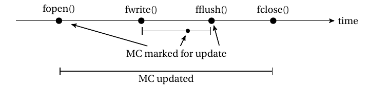

<!---
title: "Testing updates of POSIX timestamps"
date: 2020-06-02T09:00:00+02:00
aliases: [
	"/posts/02_testing_posix/",
	"/02"
]
Author: 
  Name: "Aurelien Thierry"
  Twitter: "yaps8"
Categories: ["OS timestamps"]
Tags: ["POSIX", "Linux", "OpenBSD", "FreeBSD", "timestamps", "forensics"]
draft: false
-->

> Published: June 2, 2020

# Testing updates of POSIX timestamps

Our [last blog post](01_macb_timestamps_across_POSIX.md) discussed how POSIX specifies timestamp updates operated by interfaces and utilities, and we detailed the impact of common operations (a file being written to shall get updated MC).

This post explores POSIX timestamps specification more deeply and demonstrates how to design and implement compliance tests.

Details and implementation target Linux, OpenBSD and FreeBSD.

Code and [documentation](https://github.com/QuoSecGmbH/os_timestamps/blob/master/README.md#test-posix-compliance) can be found here: https://github.com/QuoSecGmbH/os_timestamps/


# 1 - Scope

We will solely look into timestamps specified by POSIX: M (last data modification), A (last data access) and C (last file status change).

POSIX specifies when a timestamp shall be marked for update, shall be updated, shall be left untouched (when nothing is specified for a read/write operation) or when modification is unspecified (when the operation is not expected to perform a read/write or to modify timestamps):

> 	Each function or utility in POSIX.1-2017 that reads or writes data (even if the data does
	not change) or performs an operation to change file status (even if the file status
	does not change) indicates which of the appropriate timestamps shall be marked
	for update.

> 	If an implementation of such a function or utility marks for update one of these
	timestamps in a place or time not specified by POSIX.1-2017, this shall be documented

>	For the other functions or utilities in POSIX.1-2017 (those that are not explicitly required to
	read or write file data or change file status, but that in some implementations happen to do
	so), the effect is unspecified.

<!--- None of the three tested POSIX implementations aim for full compliance, thus non-compliance cases are not bugs but rather some design or implementation choices.-->

# 2 - From "marked for update" to actual update

Most timestamp updates will be done in two steps: the timestamp is marked for update and, immediately or later, it is actually updated (the change is written on the file system).

POSIX specifies that timestamps marked for update may be actually updated immediately or at a later stage:

>   An implementation may update timestamps that are marked for update immediately, or it may update such timestamps periodically.

We will first look into `fopen()` and `fclose()` specifications, then give examples of files being read and written to.

## 2.1 - Opening files: fopen()

`fopen()` is central to any file operation, POSIX specifies the following things:

>	If mode is w, wb, a, ab, w+, wb+, w+b, a+, ab+, or a+b, and the file did not previously
	exist, upon successful completion, fopen( ) shall mark for update the last data access, last
	data modification, and last file status change timestamps of the file and the last file status
	change and last data modification timestamps of the parent directory.

>	If mode is w, wb, w+, wb+, or w+b, and the file did previously exist, upon successful
	completion, fopen( ) shall mark for update the last data modification and last file status
	change timestamps of the file

Nothing is said in POSIX for files opened in read mode but as every timestamp update for read/write operations shall be documented, the absence of the specification implies that no timestamp shall be updated.

Thus:

* On new files opened in write mode, `fopen()` shall mark the file's MAC and the parent directory's MC for update
* On existing files opened in a write mode that overwrites the file (does not append), `fopen()` shall mark the file's MC for update
* On existing files opened in read mode, `fopen()` shall not modify timestamps

## 2.2 - Files ceasing to be opened and fclose()

`fclose()` shall mark MC for update if there is buffered data yet to be written to the file:

>	The fclose( ) function shall mark for update the last data modification and last file status change
	timestamps of the underlying file, if the stream was writable, and if buffered data remains that
	has not yet been written to the file.

Additionnally, once a file is not open anymore, all timestamps marked for update shall be updated:

>   All timestamps that are marked for update shall be updated when the file ceases
    to be open by any process [...]

Thus closing a file with `fclose()` shall:
* Flush potential unwritten buffered data and mark MC for update accordingly
* Update timestamps that are marked for update

## 2.3 - File read

Let's take the example of a file being opened, read, then closed:

~~~ c
FILE* fd = fopen("file", "rb");
char* buf = (char*) calloc(3, sizeof(char));
fread(buf, 1, 2, fd);
fclose(fd);
~~~

`fopen()`, when mode is "rb", has no specified impact on timestamps.

POSIX specifies that `fread()` shall mark A for update:

> 	The last data access timestamp shall be marked for update by the first successful
	execution of fgetc( ), fgets( ), fread( ), fscanf( ), getc( ), getchar( ), getdelim( ), getline( ), gets( ), or
	scanf( ) using stream that returns data not supplied by a prior call to ungetc( ).

If it did not happen before, at last when the file is closed with `fclose()` its timestamps marked for update shall be updated.

Thus, with `fopen() + fread() + fclose()` POSIX specifies the following timeline for timestamp updates:


While `fread()` shall mark the timestamps for update, the actual timestamp update may happen at any time between the `fread()` and `fclose()` calls.

## 2.4 - File write

Example of an existing file being opened, written to, flushed then closed:

~~~ c
FILE* fd = fopen("file", "wb");
fwrite("Hallo", 5, 1, fd);
fflush(fd);
fclose(fd);
~~~

As explained previously `fopen()` with the "wb" write mode shall mark MC for update (even if nothing is actually written to the file).

The actual update might happen at anytime between `fopen()` and when the file is closed (`fclose()`)

POSIX specifies the following for `fwrite()`:

> 	The last data modification and last file status change timestamps of the file shall be marked for
	update between the successful execution of fwrite( ) and the next successful completion of a call
	to fflush( ) or fclose( ) on the same stream, or a call to exit( ) or abort( ).

So MC shall be marked for update between `fwrite()` and `fflush()`, which itself shall mark MC for update if there is unwritten data:

>	If stream points to an output stream or an update stream in which the most recent operation
	was not input, fflush( ) shall cause any unwritten data for that stream to be written to the
	file, and the last data modification and last file status change timestamps of the underlying
	file shall be marked for update.

In the end, depending on implementation choice, MC shall be marked for update between two and three times, and MC shall actually be updated at least once (after the last "marked for update"), as shown here:



<!---  -->

When observing timestamps at a later stage for forensics purposes we only see the most recent change that is actually stored in the file system.
The file is last marked for update sometime between `fwrite()` and `fflush()` and thus last updated between `fwrite()` and `fclose()`.

# 3 - Testing strategy

Roughly, to test if an action actually updated a timestamp we need to store the current time `t_1`, realise the action, store the current time `t_2`, store the file's timestamps with `stat(file)` and check that it is between `t_1` and `t_2`.

`stat()` will be central to these tests and is specified to force update of timestamps marked for update, similarly to when the file is closed:
> 	All timestamps that are marked for update shall be updated when the file ceases
	to be open by any process or before a fstat( ), fstatat( ), fsync( ), futimens( ),
	lstat( ), stat( ), utime( ), utimensat( ), or utimes( ) is successfully performed on
	the file.

## 3.1 - Testing "actual update"
We use the following steps:
* Preparation: file manipulations (creating, opening...) that are not to be tested
* `stat(file)` to make sure timestamp modifications from Preparation are performed before `t_1`
* Delay to clearly separate Preparation updates (flushed in previous step) from the testing window
* `t_1 = current_time()`
* Actions to be tested
* `t_2 = current_time()`
* Delay to clearly separate updates during the testing window from checks (next step), we have to make sure that `t_MAC` is fetched after `t_2` taking time resolution into account
* `t_MAC=stat(file)`
* The tested timestamp, for instance M, is actually updated in this test if and only if `t_1 <= t_M <= t_2`


### Current time, as computed for file timestamps

The tests rely on comparison of two types of time:
* System time (`t_1` and `t_2`), typically gathered with POSIX-specified interface `clock_gettime()` with an clock id as argument, for instance `clock_gettime(CLOCK_REALTIME)`, referred as "current time"
* Timestamps assigned to files in filesystems (`t_MAC`)

Those two types can be based on different, coarsed or truncated values. Thus even when the system timestamp `t_1` was fetched before the file timestamp `t_M` was updated and fetched, there is no guarantee that `t_1 <= t_M`.

This is why, for accurate comparison and testing, we want to make sure both types are fetched and computed the same way.

POSIX only specifies that, when updated, the assigned timestamp shall be the greatest value supported by the filesystem (through truncation) that is not greater than the current time:

> 	At the point in time when an update occurs, any marked timestamps shall be set to the current time [...]

>	Whenever any of a file’s timestamps are to be set to a value V according to the rules of the preceding paragraphs of this section, 
	the implementation shall immediately set the timestamp to the greatest value supported by the file system that is not greater than V.

> 	Upon assignment, file timestamps are immediately converted to the resolution of the file system by truncation (i.e., the recorded time can
	be older than the actual time).

It is especially not specified:
* What generally is "current time" or how to fetch it. Different interfaces (and clocks) may be used depending on the needs (realtime or coarse value, resolution to the nanosecond or the second...)
* Which interface (and clock) to use for file timestamps

Our approach for `current_time()` is to fetch (or calculate) "current time" exactly as done when a timestamp is updated, making both timestamp types consistent.

This is why our `current_time()` function is OS-dependent, the next section (4 - Implementation) describes how it is implemented for each of the three tested kernels.

### Delays

<!--- The delays' goal is to ensure that updates before and after them result in different timestamps (written to the filesystem), we saw that POSIX specifies that timestamps actually written to the filesystem can be earlier (but not later) than the current time when they were written (through truncation). -->
The delays' goal is to ensure that times fetched before and after them, potentially used for timestamp updates, have different values.

The specified bound is that POSIX timestamp resolution shall not be coarser than 1 second:

> 	The resolution of timestamps of files in a file system is implementation-defined, but shall be
	no coarser than one-second resolution.

Since our `current_time()` function fetches the time used for filesystem updates, this means the underlying "current time" can be truncated up to a resolution of 1 second.

We need to be sure the underlying "current time" has a resolution no coarser than 1 second.

As previously explained there is not one specified way to determine the underlying "current time" and we cannot be sure of the resolution of this "current time" as POSIX allows implementations to use custom clocks for which the resolution is not bounded and cannot be tuned:

> An implementation may also support additional clocks. The interpretation of time values for these clocks is unspecified.

> Clock resolutions are implementation-defined and cannot be set by a process.

However POSIX-defined system-wide clocks `CLOCK_REALTIME` and `CLOCK_MONOTONIC` shall not be coarser than 20 000 000 ns (0.02s):

~~~ quote
{_POSIX_CLOCKRES_MIN}
The resolution of the CLOCK_REALTIME clock, in nanoseconds.
Value: 20 000 000
If the Monotonic Clock option is supported, the resolution of the CLOCK_MONOTONIC clock, in nanoseconds, is represented by {_POSIX_CLOCKRES_MIN}.
~~~

If "current time" is based on clock `CLOCK_REALTIME` (or has the same minimal resolution) then the resolution constraint (not coarser than 1 second) is valid, we will see in next section (4 - Implementation) that the underlying OS-dependent "current time" all respect this condition.

<!---
 As previously explained there is not one specified way to determine the underlying "current time" and we can not be sure of the resolution of this "current time" as POSIX allows implementations to use custom clocks for which the resolution is not bounded and cannot be tuned:

> An implementation may also support additional clocks. The interpretation of time values for these clocks is unspecified.

> Clock resolutions are implementation-defined and cannot be set by a process.

We based our estimations on the resolution of POSIX-defined, system-wide, clocks `CLOCK_REALTIME` and `CLOCK_MONOTONIC` that shall not be coarser than 20 000 000 ns (0.02s):

~~~ quote
{_POSIX_CLOCKRES_MIN}
The resolution of the CLOCK_REALTIME clock, in nanoseconds.
Value: 20 000 000
If the Monotonic Clock option is supported, the resolution of the CLOCK_MONOTONIC clock, in nanoseconds, is represented by {_POSIX_CLOCKRES_MIN}.
~~~

If "current time" is based on clock `CLOCK_REALTIME` (or has the same minimal resolution) the global delay shall be at least 1.04s as we need to count the resolution window twice (the time is fetched twice). The assumption that the underlying OS-dependent "current time" has a minimum resolution of 0.02 will be checked in the next section (4 - Implementation).
--->

We implement delays with `nanosleep` using clock `CLOCK_REALTIME`, we need to account for the resolution (a delay of 1.04s with `CLOCK_REALTIME` may actually "last" between 1.00s and 1.08s in terms of the underlying system clock).

The final delay we take is **1.1s** to account for potential precision difference between `current_time()` and `CLOCK_REALTIME`.

### Example with file fwrite+fclose

This example is adapted (simplified) from test GENERAL.UPDATE.WRITE_CLOSE (function `check_general_update_write_close()`).
It checks that `fwrite()+fclose()` on an existing file updates MC.

``` c
// Preparation:
char* path = misc_concat_ensure_file_exists(dir_path, __func__, 0, ns_after_open, output_file, error_file, __func__);
FILE* fd = fopen(path, "wb");

// stat(file):
get_file_timestamps(fd);

// Delay (1.1s):
misc_nanosleep(ns_after_open);

// t_1 = current_time()
struct timespec* ts_before = current_time_ns_fslike_osspecific();
    
// Actions to be tested:
fwrite("Hallo", 5, 1, fd);
fclose(fd);

// t_2 = current_time()
struct timespec* ts_after = current_time_ns_fslike_osspecific();

// Delay (1.1s):
misc_nanosleep(ns_after_open);

// t_MACB=stat(file):
struct stat_macb* file_stat = get_path_timestamps(path);

// Check result:
int result = result_MAC_updated(UPDATE_MANDATORY, NOUPDATE_OPTIONAL, UPDATE_MANDATORY, output_file, error_file, __func__, ts_before, ts_after, file_stat);
```

Function `current_time_ns_fslike_osspecific()` is the implementation-dependent way to get the "current time" used for timestamp updates.


## 3.2 - Testing "marked for update"
Tests that a timestamp is "marked for update" are based on the specification of `stat()` that will force any timestamp marked for update to be actually updated.

We use the following steps:
* Preparation: file manipulations (creating, opening...) that are not to be tested
* `stat(file)` to make sure timestamp modifications from Preparation are performed before t_1
* Delay to clearly separate Preparation updates (flushed in previous step) from the testing window
* `t_1 = current_time()`
* Actions to be tested
* `t_MAC=stat(file)`: it makes sure timestamps marked for update are actually updated and observed through `stat()`
* `t_2 = current_time()`
* In the end the tested timestamp, for instance M, shall respect: `t_1 <= t_M <= t_2`

There is no need for a delay between the last two step because fetching `t_2` does not change the stored values `t_MAC`.


Note that:
* If actions not only mark timestamps for update but also update them, the test also passes
* As marking timestamps for update is implementation-dependent and not visible from userland, it is not possible to test only for "marked for update" with this method

Testing for "marked for update but not updated":
* Could be done using one test for "marked for update" and one other for "not(actually updated)"
* Does not have compliance significance because an implementation can choose to immediately update any timestamp marked for update (making both tests equivalent)

### Example with fwrite+fflush

This example is adapted (simplified) from test INTERFACES.FILE.FFLUSH.WRITE (function `check_interfaces_file_fflush_write()`).
It checks that `fwrite()+fflush()` on an existing file marks MC for update.

~~~ c
// Preparation:
char* path = (char*) misc_concat_ensure_file_exists(dir_path, "interfaces.file.fflush.write", s_0s, ns_100ms, output_file, error_file, __func__);
FILE* fd = fopen(path, "wb");

// Delay (1.1s):
misc_nanosleep(ns_after_open);

// stat(file):
get_file_timestamps(fd);

// t_1 = current_time()
struct timespec* ts_before = current_time_ns_fslike_osspecific();

// Actions to be tested:
fwrite("Hallo", 5, 1, fd);
fflush(fd);

// t_MACB=stat(file):
struct stat_macb* file_stat = get_path_timestamps(path);

// t_2 = current_time()
struct timespec* ts_after = current_time_ns_fslike_osspecific();
      
int result = result_MAC_updated(UPDATE_MANDATORY, NOUPDATE_OPTIONAL, UPDATE_MANDATORY, output_file, error_file, __func__, ts_before, ts_after, file_stat);
~~~


# 4 - Implementation

Linux, OpenBSD and FreeBSD all use flags in the inode structure to mark M, A and C for update.

## 4.1 - OS-dependent "current time" for timestamp updates

### Linux
Linux, when updating a timestamp, calls the `current_time()` kernel function which uses the kernel function `ktime_get_coarse_real_ts64()` to get a current time specified as clock `CLOCK_REALTIME_COARSE` and truncates it to fit the file system resolution: 
* https://github.com/torvalds/linux/blob/8019ad13ef7f64be44d4f892af9c840179009254/fs/inode.c#L2191

The accessor `CLOCK_REALTIME_COARSE`:
* is documented here: https://www.kernel.org/doc/html/latest/core-api/timekeeping.html#c.ktime_get_coarse_clocktai_ts64
* has a resolution up to the nanosecond
* the resolution can be checked using the POSIX-defined call to `clock_getres(CLOCK_REALTIME_COARSE)`

Defining a specific clock (accessor) makes it directly accessible from userland, thus the implemention of our function `current_time_ns_fslike_osspecific()` on Linux is functionally equivalent to calling `clock_gettime(CLOCK_REALTIME_COARSE)`. Truncating is not implemented as we test against ext4 filesystems which have a resolution to the nanosecond.

### OpenBSD
Timestamp updates in OpenBSD (on FFS filesystems) happen in kernel function `ffs_update()`:
* https://github.com/openbsd/src/blob/3756ed2f07591c8bd3fd94b6d7b1a49fa7d6e042/sys/ufs/ffs/ffs_inode.c#L55

This function relies on function `ufs_itimes()` and then `getnanotime()` to retrieve the current time to be assigned to the updated timestamp.

Comments (https://github.com/openbsd/src/blob/3756ed2f07591c8bd3fd94b6d7b1a49fa7d6e042/sys/sys/time.h#L256) describe `getnanotime()`, following name convention of the prefix "get", as fetching a coarsed time:
* Not getting the most precise result
* Have a precision of 10 milliseconds
* Have a resolution of 1 nanosecond

Unfortunately none of the clocks exposed to userland via `clock_gettime()` (https://github.com/openbsd/src/blob/3756ed2f07591c8bd3fd94b6d7b1a49fa7d6e042/sys/kern/kern_time.c#L107) use `getnanotime()` nor another underlying function with the same "get" prefix. No clock accessor allows us to fetch a similar coarsed time.

Thus there is no direct userland way to fetch a "current time" consistent with timestamp updates.
For OpenBSD we used the generic solution described below.

### FreeBSD
Similarly to OpenBSD, FreeBSD (on UFS filesystems) updates timestamps in kernel function `ffs_update()`:
* https://github.com/freebsd/freebsd/blob/3e654350f4f4abf048bdeee0f0446c62fa72bddd/sys/ufs/ffs/ffs_inode.c#L70

This function calls `ufs_itimes()` which relies on `ufs_itimes_locked()` and then `vfs_timestamp()` to retrieve the current time to be assigned to the updated timestamp.

`vfs_timestamp()`:
* Is implemented here: https://github.com/freebsd/freebsd/blob/3c58c3daec32d24e6fee11a38c5e9d9fae312bf5/sys/kern/vfs_subr.c#L1007
* Fetches a time with different resolution depending on the kernel variable `vfs.timestamp_precision` (can be changed with `sysctl vfs.timestamp_precision=3`):
  * 0 - seconds only: global variable `time_second`
  * 1 - nanoseconds, accurate within 1/Hz: `getnanotime()`
  * **2 - microseconds (default): `microtime()`**
  * 3 (or more) - nanoseconds (with best accuracy): `nanotime()`

We focused on the default behavior that calls `microtime()`.

Both `microtime()` and `nanotime()` call `bintime()`, which provides the most precise time, and store it in the relevant structure with truncation to fit the wanted resolution:
*  `man 9 microtime` - https://www.freebsd.org/cgi/man.cgi?query=microtime&apropos=0&sektion=9
* `bintime()`, `microtime()` and `nanotime()`: https://github.com/freebsd/freebsd/blob/master/sys/kern/kern_tc.c#L395

None of the clocks exposed to  userland in `kern_clock_gettime` (https://github.com/freebsd/freebsd/blob/d0c0c12301a58778bc56eac3025dba3fd9ecd24e/sys/kern/kern_time.c#L318) use `microtime()` but clock `CLOCK_REALTIME_PRECISE` gives access to `nanotime()`.

It is thus possible to compute `microtime()` by getting `nanotime()` through `clock_gettime(CLOCK_REALTIME_PRECISE)` and truncating the result to the microsecond resolution, this is how we implemented `current_time_ns_fslike_osspecific()` on FreeBSD.

### Generic solution

The most generic way the get the "current time" used for timestamp updates is simply to open, modify and close an existing file, then use `stat(file)` to get its updated M timestamp.

This technique is not recommended because it modifies the filesystem itself, which could lead to unwanted side effects like triggering updates to timestamps that were solely marked for update.

We use this solution for OpenBSD.

## 4.2 - POSIX specification levels

Not every timestamp modification specified in POSIX is mandatory, we find the following levels and wording:
* MANDATORY ("shall"): a MANDATORY (do ACTION) test is passed if action is performed
* MAY ("may"): a MAY (do ACTION) test is passed if ACTION is performed
* NEEDNOT ("need not"): a NEEDNOT (do ACTION) test is passed if ACTION is **not performed**

For instance with `futimens()`:

> 	Upon successful completion, futimens( ) and utimensat( ) shall mark the last file status change
	timestamp for update, with the exception that if both tv_nsec fields are set to UTIME_OMIT,
	the file status change timestamp need not be marked for update.

The NEEDNOT test for action "futimens() needs not to update the last file status change timestamp of the file when both tv_nsec fields are set to UTIME_OMIT" passes if, under those circomstances, C is not updated.

# 5 - Examples

<!----
|  Description                                              |  Linux? |  OpenBSD? | FreeBSD? |  Specified?           |  Ref                                 | 
|-----------------------------------------------------------|---------|-----------|----------|-----------------------|--------------------------------------| 
|  Clock resolution shall be at least 0.02s (CLOCK_REALTIME)|  Yes    |  Yes      |  Yes     |  MANDATORY            |  GENERAL.CLOCK.RES                   | 
|  Clock CLOCK_REALTIME is incremental (increasing)         |  Yes    |  Yes      |  Yes     |  No                   |  GENERAL.CLOCK.REALTIME.INCREMENTS   | 
|  Clock (ns_fslike_osspecific) is incremental (increasing) |  Yes    |  Yes      |  Yes     |  No                   |  GENERAL.CLOCK.FSLIKE.INCREMENTS     | 
|  New file shall have MAC updated                          |  Yes    |  Yes      |  Yes     |  MANDATORY            |  GENERAL.NEW_FILE                    | 
|  New file shall have MAC updated (CLOCK_REALTIME)         |  No     |  No       |  Yes     |  No                   |  GENERAL.NEW_FILE_REALTIME           | 
|  New file shall have MAC set to same value                |  Yes    |  Yes      |  Yes     |  No                   |  GENERAL.NEW_FILE.MAC_eq             | 
|  fwrite+fclose shall update MC                            |  Yes    |  Yes      |  Yes     |  MANDATORY            |  GENERAL.UPDATE.WRITE_CLOSE          | 
|  fwrite+stat shall update MC                              |  No     |  No       |  No      |  No                   |  GENERAL.UPDATE.WRITE_STAT           | 
|  fwrite+fstat shall update MC                             |  No     |  No       |  No      |  No                   |  GENERAL.UPDATE.WRITE_FSTAT          | 
|  fwrite shall update MC                                   |  No     |  No       |  No      |  No                   |  GENERAL.UPDATE.WRITE                | 
|  fread+fclose shall update A                              |  Yes    |  Yes      |  Yes     |  MANDATORY            |  GENERAL.UPDATE.READ_CLOSE           | 
|  fread+stat shall update A                                |  Yes    |  Yes      |  Yes     |  MANDATORY            |  GENERAL.UPDATE.READ_STAT            | 
|  fread shall update A                                     |  Yes    |  No       |  No      |  No                   |  GENERAL.UPDATE.READ                 | 
|  fread shall mark A for update                            |  Yes    |  Yes      |  Yes     |  MANDATORY            |  GENERAL.UPDATE.MARK.READ            | 
|  fread+fstat shall update A                               |  Yes    |  Yes      |  Yes     |  MANDATORY            |  GENERAL.UPDATE.READ_FSTAT           | 
|  fopen(rb) shall not update MAC                           |  Yes    |  Yes      |  Yes     |  MANDATORY            |  GENERAL.UPDATE.FOPEN_R              | 
|  fopen(rb)+fstat+fclose shall not update MAC              |  Yes    |  Yes      |  Yes     |  MANDATORY            |  GENERAL.UPDATE.FOPEN_R_FSTAT_FCLOSE | 
--->

The default Linux mount option `relatime` applies a filter to updates: A updates are performed if A was earlier or equal to M or C, or at least 1 day old. Thus Linux is tested with the non-default mount option `strictatime`. 

OpenBSD and FreeBSD are tested with default mount options.

The following tests explore the behavior of previously discussed `fwrite`, `fread`, as well as file creation and clocks.
All POSIX implementation pass tests where the behavior is specified.

## 5.1 - File read and write

|  Description                                              |  Linux? |  OpenBSD? | FreeBSD? |  Specified? 
|-----------------------------------------------------------|---------|-----------|----------|-------------
|  fopen(rb) shall not update MAC                           |  Yes    |  Yes      |  Yes     |  MANDATORY  
|  fopen(rb)+fstat+fclose shall not update MAC              |  Yes    |  Yes      |  Yes     |  MANDATORY  
|  fread shall mark A for update                            |  Yes    |  Yes      |  Yes     |  MANDATORY  
|  fread shall not update A                                 |  No     |  Yes      |  Yes     |  No
|  fread+fclose shall update A                              |  Yes    |  Yes      |  Yes     |  MANDATORY  
|  fread+stat shall update A                                |  Yes    |  Yes      |  Yes     |  MANDATORY  
|  fread+fstat shall update A                               |  Yes    |  Yes      |  Yes     |  MANDATORY  
|  fwrite shall update MC                                   |  No     |  No       |  No      |  No         
|  fwrite+fclose shall update MC                            |  Yes    |  Yes      |  Yes     |  MANDATORY  
|  fwrite+stat shall update MC                              |  No     |  No       |  No      |  No         
|  fwrite+fstat shall update MC                             |  No     |  No       |  No      |  No         

[]()

We find the previously described behavior of a file read:
* `fopen` with a read-only mode and nothing being read does not trigger a timestamp update
* `fread` by itself marks A for update (on Linux it actually updates A)
* `fread` by itself does not update A OpenBSD and FreeBSD, but does on Linux
* `fread+fclose`, `fread+stat` and `fread+fstat` update A

For file write:
* `fwrite` by itself does not update MC
* `fwrite+fclose`, `fwrite+stat` and `fwrite+fstat` update MC

## 5.2 - New files

|  Description                                              |  Linux? |  OpenBSD? | FreeBSD? |  Specified? 
|-----------------------------------------------------------|---------|-----------|----------|-------------
|  New file shall have MAC updated                          |  Yes    |  Yes      |  Yes     |  MANDATORY  
|  New file shall have MAC updated (CLOCK_REALTIME)         |  No     |  No       |  Yes     |  No         
|  New file shall have MAC set to same value                |  Yes    |  Yes      |  Yes     |  No         

[]()

New files have updated MAC with M=A=C

The failed test "New file shall have MAC updated (CLOCK_REALTIME)" is the following sequence (without the usual delays):
* `t_1 = clock_gettime(CLOCK_REALTIME)`
* Create new file
* `t_2 = clock_gettime(CLOCK_REALTIME)`
* `t_MAC=stat(file)`

We can investigate why it fails on Linux:
~~~ verbatim
$ ./run_tests -t GENERAL.NEW_FILE_REALTIME
WARNING: check_general_new_file_realtime - M not updated
WARNING: check_general_new_file_realtime - A not updated
WARNING: check_general_new_file_realtime - C not updated
INFO: check_general_new_file_realtime:
INFO: Before: 1589977057s 260900329ns ; After: 1589977057s 261006919ns
INFO: M: 1589977057s 256807738ns
INFO: A: 1589977057s 256807738ns
INFO: C: 1589977057s 256807738ns
RESULT: No - No(.UNKNOWN) - New file shall have MAC updated (CLOCK_REALTIME) - GENERAL.NEW_FILE_REALTIME - check_general_new_file_realtime
~~~

We see that `t_M`, `t_A` and `t_C` (all equal to 1589977057.256807738s) are earlier than `t_1` (1589977057.260900329s).

This is a direct consequence of Linux (and OpenBSD) using coarse time for timestamp updates, as explained previously. The problem does not arrise with FreeBSD (which uses the most precise clock) nor when we use the discussed implementation-dependent function `current_time_ns_fslike_osspecific()` to fetch "current time".

## 5.3 - Clocks

|  Description                                              |  Linux? |  OpenBSD? | FreeBSD? |  Specified? 
|-----------------------------------------------------------|---------|-----------|----------|-------------
|  Clock resolution shall be at least 0.02s (CLOCK_REALTIME)|  Yes    |  Yes      |  Yes     |  MANDATORY  
|  Clock CLOCK_REALTIME is incremental (increasing)         |  Yes    |  Yes      |  Yes     |  No         
|  Clock (ns_fslike_osspecific) is incremental (increasing) |  Yes    |  Yes      |  Yes     |  No         

[]()

Those tests show that, `CLOCK_REALTIME` is always declared (test uses `clock_getres()`) as having at least the specified resolution.
The two other tests simply check that clocks are incremental.

# Conclusion

POSIX specifies many timestamp-related behavior. However the two-step update process (marked for update, updated) and the imprecision on what is "current time" for updates leave room for implementation differences and makes testing them from userland not straightforward.


<script data-goatcounter="https://yaps8.goatcounter.com/count"
        async src="//gc.zgo.at/count.js"></script>
