<!---
title: "Navigating QakBot samples with grap"
date: 2020-09-04T09:00:00+02:00
aliases: [
	"/post/grap_qakbot_navigation/",
	"/post/grap_qakbot_1/"
]
Author: 
  Name: "QuoSec"
  Twitter: "QuoSecGmbH"
Categories: ["Reverse Engineering"]
Tags: ["grap", "qakbot", "Malware"]
twitterImage: ../resources/qakbot_grap/navigation_IDA.png
draft: false
-->

> Published: September 4, 2020

# Navigating QakBot samples with grap

grap is our tool to match binaries at the assembly code level, matching control flow graphs: https://github.com/QuoSecGmbH/grap/

<!--grap can be used for malware analysis through the IDA plugin, through the python3 bindings or directly as a command-line tool.-->

This post demonstrates how to use grap to quickly find and analyse documented features (based on public reports) in published QakBot samples:

* All features and IOC described here are already published (see References)
* Samples are from Malpedia: [win.qakbot](https://malpedia.caad.fkie.fraunhofer.de/details/win.qakbot)
* We explain both the grap standalone tool and the IDA plugin

This is a tutorial demonstrating grap's features with increasing complexity.


# References

<!--Discussed in the post:-->
[1] - Reversing Qakbot - https://hatching.io/blog/reversing-qakbot/

[2] - Deep Analysis of QBot Banking Trojan - https://n1ght-w0lf.github.io/malware%20analysis/qbot-banking-trojan/

[3] - Malware Analysis: Qakbot [Part 2] - https://darkopcodes.wordpress.com/2020/06/07/malware-analysis-qakbot-part-2/

<!--
Other references on Qakbot:
* https://malwareandstuff.com/an-old-enemy-diving-into-qbot-part-1/
* https://malwareandstuff.com/an-old-enemy-diving-into-qbot-part-2/
* https://malwareandstuff.com/an-old-enemy-diving-into-qbot-part-3/
* https://darkopcodes.wordpress.com/2020/05/14/malware-analysis-qakbot-part-1/
-->

# 1 - Samples

QakBot samples are packed and the unpacking process consists in decrypting a buffer that will be written over the memory-mapped first-stage PE [1].

Thus Malpedia has a 3 types of QakBot samples, they are renamed to not disclose them, for instance:

* First-stage PE (packed): `s10`
* Dumped PE (at some stage during or after the unpacking process): `s10_dump_2`
* Unpacked PE (reconstructed): `s10_unpacked`

# 2 - Approach

We focus on features (decryption, anti-analysis, parsers...) because: 
* They will be shared across samples
* Some are already documented

Rules (grap patterns) detecting features:
* Help navigate (similar) new samples
* Allow to study deleted, modified or new features within incoming samples

# 3 - First-stage PE: PE parsing

QakBot unpacks itself and fixes headers [1], we can thus expect comparison or write of values such as "MZ" (0x5a4d) or "PE" (0x4550).

The easiest way is to write a quick pattern that will be automatically converted as a full grap pattern.
Looking for any instruction containing 0x5a4d can be done with `grap 0x5a4d *`:


```
$ grap 0x5a4d *
s05.grapcfg - 2035 instructions
1 matches: tmp0 (1)

tmp0 - match 1
1: 0x401933, cmp eax, 0x5a4d
---
s12.grapcfg - 1616 instructions
1 matches: tmp0 (1)

tmp0 - match 1
1: 0x402dfb, cmp word ptr [eax], 0x5a4d
---
s12_unpacked_1.grapcfg - 13891 instructions
1 matches: tmp0 (1)

tmp0 - match 1
1: 0x40451b, mov eax, 0x5a4d
```

This first run will disassemble the binaries using grap's embedded disassembler (recursive disassembler based on [Capstone](https://www.capstone-engine.org/)) and save the disassembly into ".grapcfg" files so there is no need to disassemble them again.


Let's investigate the generated pattern (`grap -v` will output its path, the IDA plugin can also be used) and see that this is done through a regex on the full instruction string:

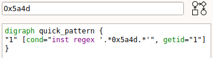 

A more precise condition can be written to match any instruction having 0x5a4d or 0x4550 as an argument: `arg1 is 0x5a4d or arg2 is 0x5a4d or arg1 is 0x4550 or arg2 is 0x4550` (see [trick_PEparsing.grapp](../resources/qakbot_grap/trick_PEparsing.grapp)):


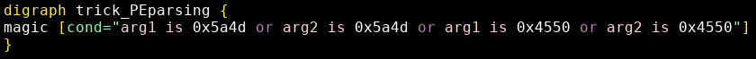

<!-- -->
<!-- -->

Within instruction conditions most fields (`inst`, `arg1`, `arg2`, `opcode`) are considered and matched as strings. Those strings are obtained through Capstone disassembly (even within IDA), patterns shall thus be written with Capstone syntax in mind.


# 4 - Unpacked samples
## 4.1 - cpuid

QakBot uses the `cpuid` instruction to determine whether it is running in a VM [1].
It first gets the CPU vendor with `eax=0` and the processor features with `eax=1` [2].

Let's find `cpuid` usage within our samples:
```
$ grap -q "opcode is cpuid" *.grapcfg
s02_unpacked_1.grapcfg (13898) - tmp0 (2)
s12_unpacked_1.grapcfg (13891) - tmp0 (2)
s06_dump.grapcfg (21194) - tmp0 (2)
s08.grapcfg (22464) - tmp0 (2)
s08_dump.grapcfg (21151) - tmp0 (2)
s10.grapcfg (12479) - tmp0 (2)
s10_dump_2.grapcfg (15130) - tmp0 (2)
s15.grapcfg (10483) - tmp0 (2)
```

Two unpacked samples match, both have two 'cpuid' matches, let's investigate those matches by looking also for the instruction preceding `cpuid`:

```
$ grap "*->opcode is cpuid" s12_unpacked_1.grapcfg
s12_unpacked_1.grapcfg - 13891 instructions
2 matches: tmp0 (2)

tmp0 - match 1
1: 0x406260, mov eax, 1
2: 0x406265, cpuid

tmp0 - match 2
1: 0x4062a7, xor eax, eax
2: 0x4062a9, cpuid
```

The pattern `*->opcode is cpuid` means: look for any instruction that is sequentially followed by `cpuid`.

This sample has the expected behavior: one call with `eax=0` (`xor eax, eax`) and one call with `eax=1` (`mov eax, 1`).

We can use this pattern within IDA using bindings to find where these calls are located:

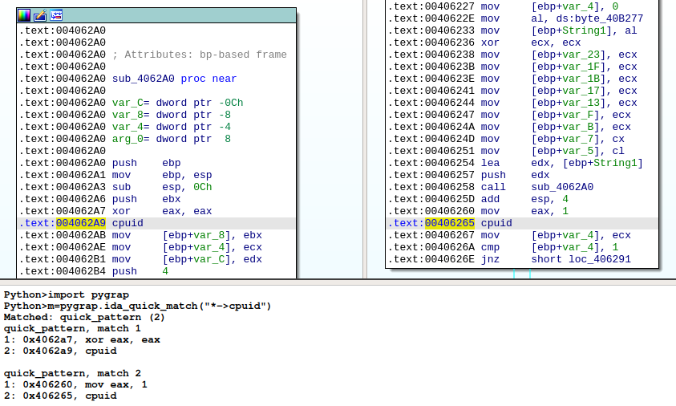

We can also use grap to quickly review all instructions preceding `cpuid` to find possible alternatives:

```
$ grap "PRE:* -> opcode is cpuid" *.grapcfg | grep PRE
PRE: 0x406260, mov eax, 1
PRE: 0x4062a7, xor eax, eax
PRE: 0x40b146, mov eax, 1
PRE: 0x40b19d, xor eax, eax
PRE: 0x404bef, xor eax, eax
PRE: 0x404bff, mov eax, 1
PRE: 0x40b160, mov eax, 1
PRE: 0x40b1ad, xor eax, eax
PRE: 0x4087ee, xor eax, eax
PRE: 0x4087fe, mov eax, 1
PRE: 0x403d27, xor eax, eax
PRE: 0x403db7, mov eax, 1
PRE: 0x406260, mov eax, 1
PRE: 0x4062a7, xor eax, eax
PRE: 0x44a5e9, xor eax, eax
PRE: 0x44a5f9, mov eax, 1
PRE: 0x405610, mov eax, 1
PRE: 0x405657, xor eax, eax
```

The pattern `"PRE:* -> opcode is cpuid"` defines the name of the preceding instruction (PRE), allowing for easy grepping.

The `cpuid` instruction is, as expected, always called with `eax=0` or `eax=1`.

A simple pattern detecting this technique is (see [trick_cpuid.grapp](../resources/qakbot_grap/trick_cpuid.grapp)):

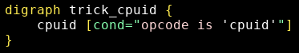

## 4.2 - VMWare detection

Reports describe Qakbot's attempts at detecting VMWare [1] through a technique described by VMWare:
* https://kb.vmware.com/s/article/1009458 - see "Hypervisor port"
* Doing a `in` on port 0x5658 with:
  * eax = 0x564D5868 (VMware hypervisor magic value, "VMXh")
  * ebx = 0xFFFFFFFF (UINT_MAX)
  * ecx = 0x0a (Getversion command identifier)
  * edx = 0x5658 (hypervisor port number)
* If you are running on VMWare, it returns ebx = 0x564D5868 (the same VMware hypervisor magic value)

We can look for a `cmp` instruction with the VMware hypervisor magic value as argument:
* This leads to a function implementing this VMWare detection
* Using the IDA plugin we can create a detection pattern based on the `in` instruction and its arguments

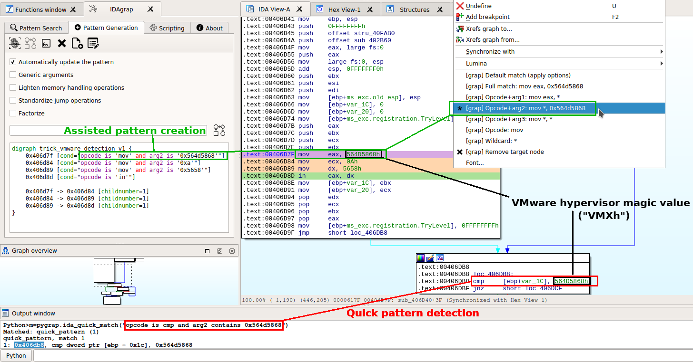

The IDA plugin allows for interactive pattern creation:
* Define the root node and target nodes
* Choose general options:
  * "Generic arguments" will match on opcodes rather than full instructions: `mov eax, 0x564D5868` -> `mov`
  * "Lighten memory handling operations" will change some generic memory instructions (`push`, `mov`, `lea`...) into wildcards (`true`)
  * "Standardize jump operations" will streamline conditional jumps (`je`, `jne`...) and calls into the same construct (`nchildren==2`)
  * "Factorize" groups identical conditions with repeat, for instance: `repeat=*, lazyrepeat=true` 
* Set the matching precision for each individual instruction (right click): `mov eax, 0x564D5868`, `mov eax, *`, `mov *, 0x564D5868`, `mov`, or the wildcard `*`

The shown generated detection pattern is very specific: if the `mov` instructions were re-ordered, the code would still be identical but the pattern would not detect it.

To base detection on the magic value and `in`, we can manually write a pattern that will:
* Match any instruction containing the magic value: `inst regex '.*0x564d5868.*'`
* Followed by any instructions (0 to 5): `cond="true", minrepeat=0, maxrepeat=5, lazyrepeat=true`
* Ending by an `in` instruction: `opcode is 'in'`

We now have 3 patterns (see [trick_vmware_detection.grapp](../resources/qakbot_grap/trick_vmware_detection.grapp)):

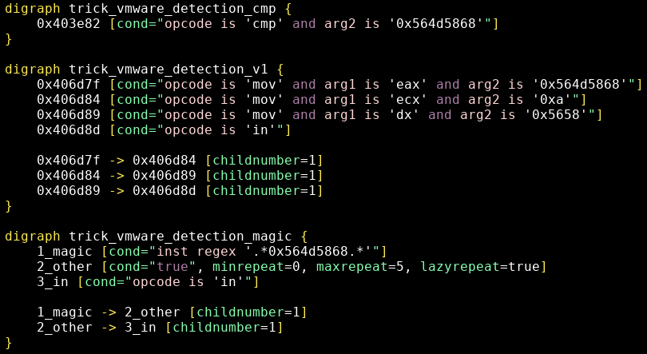

Let's try our patterns on the samples:

```
$ grap -q trick_vmware_detection.grapp *.grapcfg
s02_unpacked_1.grapcfg (13898) - trick_vmware_detection_cmp (1), trick_vmware_detection_magic (2), trick_vmware_detection_v1 (1)
s06_dump.grapcfg (21194) - trick_vmware_detection_cmp (1), trick_vmware_detection_magic (2)
s08_dump.grapcfg (21151) - trick_vmware_detection_cmp (1), trick_vmware_detection_magic (2)
s10_dump_2.grapcfg (15130) - trick_vmware_detection_cmp (1), trick_vmware_detection_magic (2)
s12_unpacked_1.grapcfg (13891) - trick_vmware_detection_cmp (1), trick_vmware_detection_magic (2), trick_vmware_detection_v1 (1)
s21.grapcfg (11685) - trick_vmware_detection_cmp (1), trick_vmware_detection_magic (1), trick_vmware_detection_v1 (1)
s23_unpacked.grapcfg (10078) - trick_vmware_detection_magic (2), trick_vmware_detection_v1 (1)
```

7 samples match:
* As expected the generic `trick_vmware_detection_magic` has better results than `trick_vmware_detection_v1`
* Matching samples all match both `trick_vmware_detection_cmp` and `trick_vmware_detection_magic`
* `trick_vmware_detection_magic` usually matches twice in those samples

Let's look at the `trick_vmware_detection_magic` matches (`-m` forces to output matching instructions):
```
$ grap -m trick_vmware_detection.grapp s02_unpacked_1.grapcfg
s02_unpacked_1.grapcfg - 13898 instructions
4 matches: trick_vmware_detection_cmp (1), trick_vmware_detection_magic (2), trick_vmware_detection_v1 (1)

trick_vmware_detection_magic - match 1
1_magic: 0x406338, mov eax, 0x564d5868
2_other0: 0x40633d, mov ecx, 0x14
2_other1: 0x406342, mov dx, 0x5658
3_in: 0x406346, in eax, dx

trick_vmware_detection_magic - match 2
1_magic: 0x406d7f, mov eax, 0x564d5868
2_other0: 0x406d84, mov ecx, 0xa
2_other1: 0x406d89, mov dx, 0x5658
3_in: 0x406d8d, in eax, dx
```

There is a variant of the technique described by VMWare, this time with `ecx=0x14`.

In this case the `in` instruction calls the VMWare function to get memory size, this can also be used for VMWare detection: [https://www.aldeid.com/wiki/VMXh-Magic-Value](https://www.aldeid.com/wiki/VMXh-Magic-Value).


### repeat and lazyrepeat

<!--We saw examples of patterns with sequentially-repeated instructions.-->
By default `repeat` will match the maximum of sequential instructions which all have a single parent and a single child (thus within the same basic-block containing no jump nor `call`).

With `lazyrepeat=true`, repeat will stop at the first instruction matching the next condition in the pattern:


* `xor, xor, xor` can be matched with `cond="opcode is xor", repeat=3`
* `xor, xor, xor` can also be matched by `cond="opcode is xor", repeat=*`
* `xor, xor, xor, push` can be matched by a pattern that has `cond="opcode is xor", repeat=*, lazyrepeat=true` followed by `cond="opcode is push"`

Unfortunately this approach makes some code sequences difficult to match.
Let's try to match all basic blocks with this shape:
* between 1 and 4 of any instructions 
* `xor` 
* `call`

A potential pattern would be:
<!--
```
digraph any_xor_call {
any [cond=true, minrepeat=1, maxrepeat=4, lazyrepeat=true]
xor [cond="opcode is xor"]
call [cond="opcode is call"]

any−>xor
xor−>call
}
```
-->

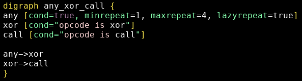

Let's try to match `push, push, xor, xor, call` with this pattern.


If, as shown, we set `lazyrepeat=true`, candidates for each node are:
* any: `push, push` (stops at the first `xor` instance)
* xor: the first `xor`
* call: tries to match the second `xor` (**no match**)

Alternatively, if we set `lazyrepeat=false` ("any" node), we get the following candidates:
* any: `push, push, xor, xor` (takes the maximum number of sequential instructions)
* xor: tries to match `call` (**no match**)

The pattern can thus not match the wanted instruction sequence.

One solution is to use `repeat=+` with `lazyrepeat=true` when matching on `xor`:

<!--
```
digraph any_xor_call_v2 {
any [cond=true, minrepeat=1, maxrepeat=4, lazyrepeat=true]
xor [cond="opcode is xor", repeat=+, lazyrepeat=true]
call [cond="opcode is call"]

any−>xor
xor−>call
}
```
-->

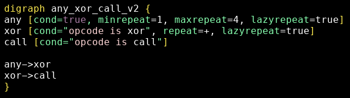

Candidates are now:
* any: `push, push` (stops at the first `xor` instance)
* xor: `xor, xor` (stops at the first `call` instance)
* call: `call`
* **It matches!**

Be aware of the behavior of `lazyrepeat` when writing and testing patterns with repeated instructions: it leads to many unintuitive behavior (no match).


## 4.3 - Obfuscation with empty loops

Qakbot uses unreachable empty loops as an obfuscation method [1]:

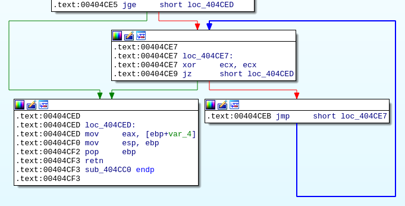

Basic blocks at addresses 0x404ce7 and 0x404ceb are unreachable.

A quick pattern can detect the loop: `opcode is xor and arg2 is _arg1 -> je -> jmp -2> 1`:
* `arg2 is _arg1`: matches when both arguments are identical
* `je` instead of `jz` because Capstone outputs `je`
* `je -> jmp`: `je`'s child number 1 (sequentially following) is `jmp`
* `jmp -2> 1`: `jmp`'s child number 2 (the remote one, not sequentially following) is the first matched node (`xor`), defining the loop

This pattern detects an unreachable empty loop using `xor`, `je` and `jmp` because when both `xor` arguments are identical the result is 0 and the condition jump `je` is always taken.

We can look for potential variants with `xor` having different arguments and different conditional jumps, including cases where the jump is not taken : `xor -> * -*> * -2> 1`:
* `-*>`: follow both child number 1 and child number 2

Matching both patterns on the samples:
```
$ grap -q "opcode is xor and arg2 is _arg1 -> je -> jmp -2> 1" -p "xor -> * -*> * -2> 1" *.grapcfg 
s01_unpacked.grapcfg (53616) - tmp0 (224), tmp1 (224)
s02_unpacked_1.grapcfg (13898) - tmp0 (87), tmp1 (87)
s08_dump.grapcfg (21151) - tmp0 (625), tmp1 (625)
s07_dump.grapcfg (48735) - tmp0 (219), tmp1 (219)
[...]
```

We find:
* Generalized use of this technique across the samples
* Both patterns (tmp0 and tmp1) match the same number of times: the obfuscation is always the same, no similar alternative was found

The full patterns for this technique are (see [qakbot_trick_emptyloop.grapp](../resources/qakbot_grap/qakbot_trick_emptyloop.grapp)):

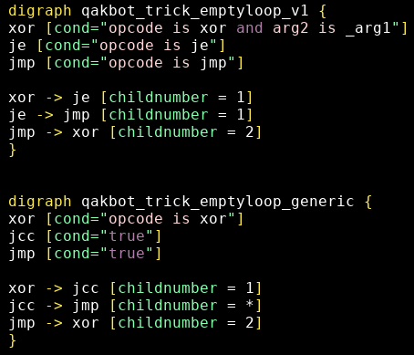

Back into IDA, the plugin finds and colors matches:

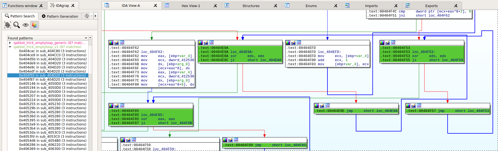

# 4.4 -  RC4 Key Scheduling

Qakbot uses RC4 to decrypt an embedded resource [2,3].

RC4's Key Scheduling algorithm begins with creating a permutation array with all values from 0 to 255: `S=[i for i in range(0, 0x100)]`.

One documented sample (see "RC4 ENCRYPTION" in [3]) uses a `mov eax, 0x100` followed by a `push`, we can find it in our samples with `grap -q "mov eax, 0x100 -> push" *.grapcfg`, exploring the matches leads to the following function from which we can create a more precise pattern:

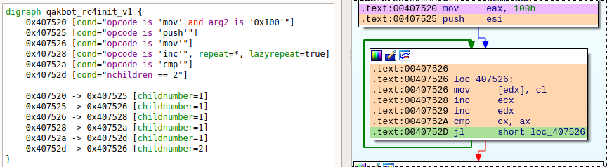

In many samples the implementation is actually slightly different, without `push esi`:

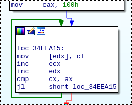

Our final pattern will have this `push` instruction as an optional match with `repeat=?` (see [qakbot_rc4init.grapp](../resources/qakbot_grap/qakbot_rc4init.grapp)):

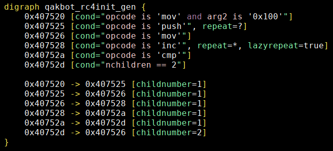

<!--
# 4.5 - Strings decryption
[2]
-->

# 5 - Sample navigation

Putting together the previous patterns in a single folder under the right plugin folder (on Linux in "~/idapro-7.5/plugins/idagrap/patterns/test/misc/files/qakbot_patterns") will make them available within the plugin.

Matching the patterns on unpacked samples (`-sa` shows also non-matched samples):
```
grap -q -sa qakbot_patterns/ *_unpacked*.grapcfg
s02_unpacked_1.grapcfg (13898) - qakbot_rc4init_gen (1), qakbot_trick_emptyloop_generic (87), qakbot_trick_emptyloop_v1 (87), trick_PEparsing (3), trick_cpuid (2), trick_vmware_detection_cmp (1), trick_vmware_detection_magic (2), trick_vmware_detection_v1 (1)
s12_unpacked_4.grapcfg (5456)
s02_unpacked_2.grapcfg (25461) - qakbot_rc4init_gen (1), qakbot_trick_emptyloop_generic (84), qakbot_trick_emptyloop_v1 (84), trick_PEparsing (1)
s01_unpacked.grapcfg (53616) - qakbot_rc4init_gen (1), qakbot_trick_emptyloop_generic (224), qakbot_trick_emptyloop_v1 (224), trick_PEparsing (3)
s03_unpacked.grapcfg (47070) - qakbot_rc4init_gen (1), qakbot_trick_emptyloop_generic (219), qakbot_trick_emptyloop_v1 (219), trick_PEparsing (3)
s04_unpacked.grapcfg (52604) - qakbot_rc4init_gen (1), qakbot_trick_emptyloop_generic (224), qakbot_trick_emptyloop_v1 (224), trick_PEparsing (3)
s07_unpacked.grapcfg (47281) - qakbot_rc4init_gen (1), qakbot_trick_emptyloop_generic (219), qakbot_trick_emptyloop_v1 (219), trick_PEparsing (3)
s09_unpacked.grapcfg (35471) - trick_PEparsing (2)
s12_unpacked_1.grapcfg (13891) - qakbot_rc4init_gen (1), qakbot_trick_emptyloop_generic (87), qakbot_trick_emptyloop_v1 (87), trick_PEparsing (3), trick_cpuid (2), trick_vmware_detection_cmp (1), trick_vmware_detection_magic (2), trick_vmware_detection_v1 (1)
s19_unpacked.grapcfg (36736) - qakbot_rc4init_gen (1), qakbot_trick_emptyloop_generic (176), qakbot_trick_emptyloop_v1 (176)
s20_unpacked.grapcfg (38455) - qakbot_rc4init_gen (1), qakbot_trick_emptyloop_generic (219), qakbot_trick_emptyloop_v1 (219), trick_PEparsing (2)
s22_unpacked.grapcfg (34460) - trick_PEparsing (2)
s23_unpacked.grapcfg (10078) - trick_vmware_detection_magic (2), trick_vmware_detection_v1 (1)
[...]
```

The are some differences amonsts unpacked samples:
* Some do not have the VM detection features (`cpuid`, VMWare detection)
* Some miss some data and code (unpacking was unsuccessful?): s22_unpacked
* Some are specific modules that do not exhibit the described features (the main module does): s12_unpacked_4

Though we will not go further now, those differences can be a way to distinguish between versions and sample types.

Within IDA the patterns help navigate a sample by finding the documented features and leading to their implementations:

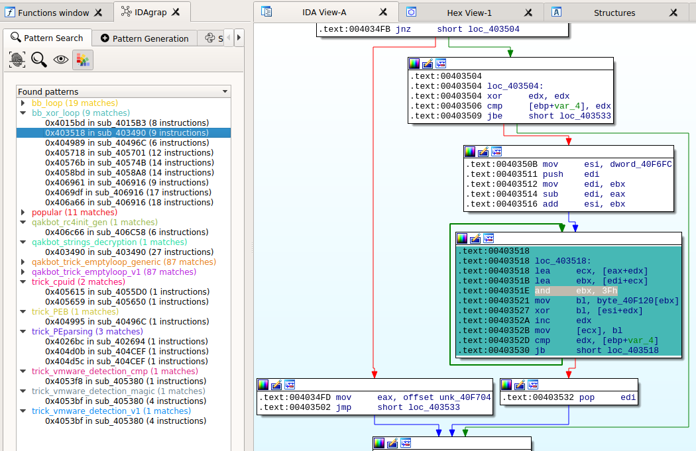

Besides the previously described patterns, the plugin includes pre-defined patterns such as:
* **bb_loop**: basic block loops (usually small loops)
* **bb_xor_loop**: basic bloc loops containing a `xor` instruction, can be used to find decryption routines
* **popular**: instructions with at least 10 incoming edges (`nfathers>=10`)
* **trick_PEB**: access to the process's Process Environement Block (for instance with `mov eax, dword ptr fs:[0x30]`), this is often used to detect debuggers through the `BeingDebugged` field ([https://www.aldeid.com/wiki/PEB-Process-Environment-Block](https://www.aldeid.com/wiki/PEB-Process-Environment-Block))

The screenshot shows a match of a basic block containing a `xor` instruction with pattern **bb_xor_loop**.
The highlighted instruction (`and ebx, 0x3f`) is actually part of the documented string decryption function [2] (the decryption script contains the following operation: `idx&0x3F`).

The strings decryption function will be further described in another post, along with a method to automatically decrypt the samples' strings.

# Conclusion
We demonstrated how to use grap to find and analyze documented malware features in public samples as a way to get up-to-speed on a malware family.

Creating grap patterns matching against malware samples is simplified by the IDA plugin and the quick pattern syntax. In complex cases you will still need to understand the pattern syntax and write them manually.

Patterns are useful to find implementation alternatives and to navigate and classify unknown samples.

# Resources
More documentation on grap can be found here:

* Install (Linux): https://github.com/QuoSecGmbH/grap/#installation
* Install (Windows): https://github.com/QuoSecGmbH/grap/blob/master/WINDOWS.md
* Install (IDA plugin): https://github.com/QuoSecGmbH/grap/blob/master/IDA.md
* Pattern syntax: https://github.com/QuoSecGmbH/grap/releases/download/v1.1.0/grap_graphs.pdf
* Syntax highlighting (vim): https://github.com/QuoSecGmbH/grap/blob/master/doc/syntax_highlighting.md


<script data-goatcounter="https://yaps8.goatcounter.com/count"
        async src="//gc.zgo.at/count.js"></script>
