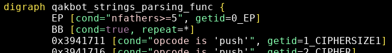

<!---
title: "grap: Automating QakBot strings decryption"
date: 2020-09-10T09:00:00+02:00
aliases: [
	"/post/grap_qakbot_strings/",
	"/post/grap_qakbot_2/"
]
Author: 
  Name: "QuoSec"
  Twitter: "QuoSecGmbH"
Categories: ["Reverse Engineering"]
Tags: ["grap", "qakbot", "Malware"]
twitterImage: ../resources/qakbot_grap/strings_IDA6.png
draft: false
-->

> Published: September 10, 2020

Our [last grap post](grap_qakbot_navigation.md) demonstrated on how to use grap to create and find patterns within QakBot samples.

This post focuses on QakBot's documented strings decryption feature:

* Create patterns to find the function where it is implemented
* Extract relevant variables (decryption key...)
* Automate decryption:
  * within IDA 
  * as a standalone script using `pefile` and grap bindings

# References

<!--Discussed in the post:-->
[1] - Reversing Qakbot - https://hatching.io/blog/reversing-qakbot/

[2] - Deep Analysis of QBot Banking Trojan - https://n1ght-w0lf.github.io/malware%20analysis/qbot-banking-trojan/#encrypted-strings

[3] - Malware Analysis: Qakbot [Part 2] - https://darkopcodes.wordpress.com/2020/06/07/malware-analysis-qakbot-part-2/

<!--
Other references on Qakbot:
* https://malwareandstuff.com/an-old-enemy-diving-into-qbot-part-1/
* https://malwareandstuff.com/an-old-enemy-diving-into-qbot-part-2/
* https://malwareandstuff.com/an-old-enemy-diving-into-qbot-part-3/
* https://darkopcodes.wordpress.com/2020/05/14/malware-analysis-qakbot-part-1/
-->

# 1 - Decryption function

QakBot's strings are encrypted using a simple XOR cipher with a repeating key [2].

Looking into a decryption implementation [2] we find the operation `idx & 0x3F` (the key size is 0x40=64), let's use grap to find it with IDA bindings (`opcode is 'and' and arg2 is 0x3f`):


Two (out of four) matches are in the same function that implements strings decryption.
The decryption function takes an offset as argument, decrypts the ciphertext at this offset, and returns the plaintext.

A first pattern to detect this decryption function focuses on the `and` and `xor` operations within a loop (see [qakbot_strings_3f.grapp](../resources/qakbot_grap/qakbot_strings_3f.grapp)):


# 2 - Parsing variables

We have found the decryption function, we can use grap to create a more precise pattern.
As we want to automate decryption we have to find function variables, including:

* Address and size of the ciphertext
* Address and size of the keystream

# 2.1 - Pattern creation

Let's create an initial pattern with the IDA plugin :


We used the UI to create a pattern matching exactly the instructions containing the variables.
Let's edit it to:
* Match when the variables are different (match on opcode for instance)
* Output the instructions where variables are defined with `getid`

The parsing pattern for the decryption function is (see [qakbot_strings_parsing.grapp](../resources/qakbot_grap/qakbot_strings_parsing.grapp)):


# 2.2 - Variables across samples

We can use grep to output matching instructions from samples with the wanted decryption function:

```
$ grap qakbot_strings_parsing.grapp *.grapcfg | grep CIPHERSIZE1
1_CIPHERSIZE1: 0x5f09cb, push 0x8a3
1_CIPHERSIZE1: 0x5f15cb, push 0x8a3
1_CIPHERSIZE1: 0x403537, push 0x1567
1_CIPHERSIZE1: 0x590ccfa, push 0x14d0
1_CIPHERSIZE1: 0x2ff87af, push 0xa8e
1_CIPHERSIZE1: 0x1cd90a, push 0x14d0
1_CIPHERSIZE1: 0x2ed238c, push 0xa45
1_CIPHERSIZE1: 0x7aa7aff, push 0xa8e
1_CIPHERSIZE1: 0x403537, push 0x1567
[...]
```

We find that:

* CIPHERSIZE varies across samples
* KEYSIZE is always 0x40


# 3 - Matching the whole function

We want to study calls to the decryption function. For this we need to find its entrypoint.

Back into our sample, the created pattern does not begin at the function entrypoint but there is only one basic block in between:


This basic block can be matched easily:

* Match the first instruction based on multiple incoming nodes (the decryption function is called many times): `nfathers>=5`
* Match the remainder of the basic block with `repeat=*` (`lazyrepeat=false`)

This can be included into the previous pattern (see [qakbot_strings_parsing_func.grapp](../resources/qakbot_grap/qakbot_strings_parsing_func.grapp)):




# 4 - Matching function calls

The decryption function is called with its argument (offset within the ciphertext buffer) pushed on the stack.
Most of the time the `push` is immediately followed by the `call` but this is not always the case:


At this point we know the function entrypoint. So instead of extending the same pattern again, we can use a pattern template using a placeholder for the entrypoint (it will have to be replaced by a script):
 


# 5 - Automate decryption

We now have the necessary patterns to automate strings decryption in an IDA script:
* Find and parse function variables
* Find calls to the decryption function and parse pushed arguments

# 5.1 - Parsing the function variables

The python bindings give access to the matched instructions through the named defined by `getid`.

Some of the parsed information is structured (opcode, arg1, arg2, address...) but many fields are simply strings (arg1, arg2 for instance) so you will need some parsing to get the right information. The bindings provide a few parsers:

* parse_first_immediate: returns the first integer found in an immediate construct(`0x3f` returns 0x3f, `43` returns 43, `0x23+eax` return `None`)
* parse_first_indirect: returns the first integer in an indirect construct (`[0x394173e]` returns 0x394173e, `[0x394173e+ax]` returns `None`)
* parse_first_address: returns the first hex found integer (with 0x), regardless of the construct (`0x3f` returns 0x3f, `0x23+eax` return 0x23, `[0x394173e+ax]` returns 0x394173e, `43` returns `None`)
* parse_int_hex: converts a string representing an integer (`0x3f`, `43`) into its integer counterpart


``` python3
import pygrap

pattern_function = "..." # see qakbot_strings_parsing_func.grapp

def parse_decrypt_function():
	matches = pygrap.ida_match(pattern_function, print_matches=False)
	if "qakbot_strings_parsing_func" in matches:
		for match in matches["qakbot_strings_parsing_func"]:
			func_addr = match["0_EP"][0].info.address
			size1 = pygrap.parse_first_immediate(match["1_CIPHERSIZE1"][0].info.arg1)
			cipher_addr = pygrap.parse_first_immediate(match["2_CIPHER"][0].info.arg1)
			size2 = pygrap.parse_first_immediate(match["3_CIPHERSIZE2"][0].info.arg2)
			xorkey_addr = pygrap.parse_first_address(match["5_XORKEY"][0].info.arg2)
            
			if size1 != size2 + 1:
				print("ERROR: size1 and size2 do not match")
				return
			print("Decryption function at:", hex(func_addr))
			print("XOR key at:", hex(xorkey_addr))
			print("XOR key:", idc.get_bytes(xorkey_addr, 0x40).hex())
			print("Cipher block at:", hex(cipher_addr))
			print("Cipher block size:", hex(size1))
            
			return func_addr, xorkey_addr, cipher_addr, size1
```

Ran into IDA, the script parses the decryption function:


# 5.2 - Decrypting strings

We now have the function variables and can, for each function call, decrypt the corresponding string and add a comment within IDA.

``` python3
pattern_call="""
digraph push_call_func {
	push [cond="opcode is push", getid=PUSH]
	notpush [cond="not(opcode is push)", minrepeat=0, maxrepeat=5, lazyrepeat=true]
	call [cond="opcode is call"]
	func [cond="address == FILL_ADDRESS"]
    
	push -> notpush
	notpush -> call
	call -> func [childnumber=2]
}
"""

def decrypt_strings():
	func_addr, xorkey_addr, cipher_addr, cipher_size = parse_decrypt_function()

	pattern_call_final = pattern_call.replace("FILL_ADDRESS", hex(func_addr))
	matches = pygrap.ida_match(pattern_call_final, print_matches=False)
    
	if "push_call_func" in matches:
		for match in matches["push_call_func"]:
			push_inst = match["PUSH"][0]
			push_addr = push_inst.info.address
			offset = pygrap.parse_first_immediate(push_inst.info.arg1)
			if offset:
				dec = decrypt_string(offset, xorkey_addr, cipher_addr, cipher_size)
				print(hex(push_addr), hex(offset), dec)
				idc.set_cmt(push_addr, dec, 1)
```

The decryption itself is a XOR stream cipher:

``` python3
def decrypt_string(offset, xorkey_addr, cipher_addr, cipher_size):
	if offset >= cipher_size:
		return
	res = ""
	while offset < cipher_size - 1:
		cipher_b = idc.get_bytes(cipher_addr+offset, 1)[0]
		key_b = idc.get_bytes(xorkey_addr + (offset&0x3F), 1)[0]
		c =  cipher_b ^ key_b
		if c == 0:
			break
		res += chr(c)
		offset += 1
	return res
```

As expected the script appends decrypted strings as a comment:


The full IDA script can found here: [qakbot_strings_decrypt_IDA.py](../resources/qakbot_grap/qakbot_strings_decrypt_IDA.py_DL)


# 5.3 - Standalone script

The script needs some change for it to run without IDA:
* Replace IDA functions with `pefile` alternatives: `idc.get_bytes` -> `pe.get_data`
* Replace grap IDA helpers with generic bindings: `pygrap.ida_match` -> `pygrap.match_graph`
* Add a few checks to handle errors

Out of IDA grap does the disassembly itself, when possible it will rely on an existing .grapcfg file:
``` python
    bin_path = sys.argv[1]
    dot_path = sys.argv[1] + ".grapcfg"

    # use_existing specifies wether an existing dot file should be used unchanged or overwritten
    pygrap.disassemble_file(bin_path=bin_path, dot_path=dot_path, use_existing=True)

    data = open(bin_path, "rb").read()
    pe = pefile.PE(data=data)
    pe_baseaddr = pe.OPTIONAL_HEADER.ImageBase
    
    pe_cfg = pygrap.getGraphFromPath(dot_path)
    decrypt_strings(pe, pe_baseaddr, pe_cfg)
```

The full script can found here: [qakbot_strings_decrypt.py](../resources/qakbot_grap/qakbot_strings_decrypt.py_DL)

Running it on all the unpacked samples reveals further IOCs:

```
$ for i in *_unpacked; do python3 qakbot_strings_decrypt.py $i; done
---
Sample: s01_unpacked
Decryption function at: 0x590cce9
XOR key at: 0x5920df0
XOR key: 10b5f45c25f213946f2a5c504fc091ec4405de29ceb1ec0190997a0ccb6db09ca0fb043a40d1eaab79b02226b6aeede2ef7ae2a5a4a3c07f5046f44a741d2332
Cipher block at: 0x591c320
Cipher block size: 0x14d0

Strings:
0x58f1211 0x386 SOFTWARE\Microsoft\Windows\CurrentVersion\Run
0x58f287d 0x1499 netteller.com
0x58f5683 0x30b injects_disabled
0x58f6523 0x7c0 %%%BOT_NICK%%%
0x591345c 0x2c4 c:\pagefile.sys.bak2.txt

[...]
---
Sample: s03_unpacked
Decryption function at: 0x2ff7b9e
XOR key at: 0x300b020
XOR key: 1f0bae1ea5621beab6b7e62939131e95b938e527c399152d4367c2fa20d50a86e93d4a02d0502fadbceec2ddc7e4e4b2dc1a473cd17c719ab323cee89cff5468
Cipher block at: 0x3007be8
Cipher block size: 0xa8e

Strings:
0x2fe286f 0xa7 cashmanagementconnectionstring
0x2fe52f8 0x87 rapportgp
0x2fe6507 0x203 %%%BOT_NICK%%%
0x2fe9ae2 0x649 /perl/test/gw2.pl
0x2fed0dd 0x280 Administrator

[...]
```

# Conclusion

We demonstrated how to use grap (through python bindings and the IDA plugin) to find, detect and parse QakBot's documented string decryption function.

grap can be used to automate the parsing of the function's variables and arguments.
The bindings were used to find and decrypt the obfuscated strings, either within IDA or as a standalone script using `pefile`.


# Resources
More documentation on grap can be found here:

* Install (Linux): https://github.com/QuoSecGmbH/grap/#installation
* Install (Windows): https://github.com/QuoSecGmbH/grap/blob/master/WINDOWS.md
* Install (IDA plugin): https://github.com/QuoSecGmbH/grap/blob/master/IDA.md
* Pattern syntax: https://github.com/QuoSecGmbH/grap/releases/download/v1.1.0/grap_graphs.pdf
* Syntax highlighting (vim): https://github.com/QuoSecGmbH/grap/blob/master/doc/syntax_highlighting.md


<script data-goatcounter="https://yaps8.goatcounter.com/count"
        async src="//gc.zgo.at/count.js"></script>
